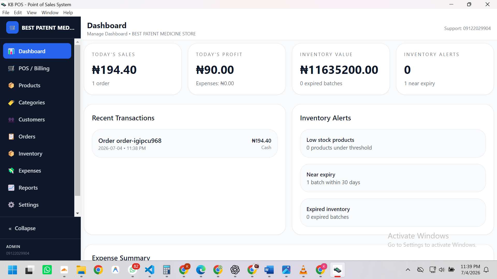
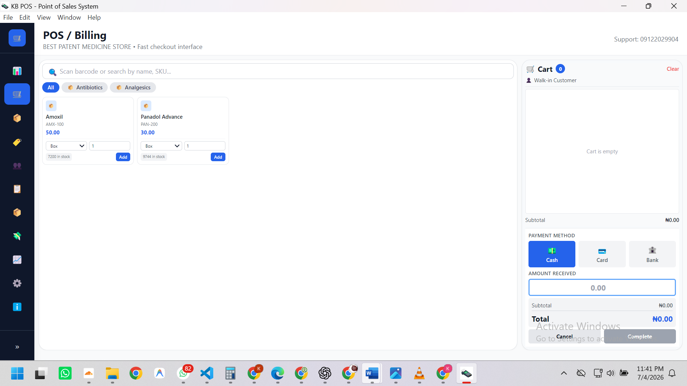
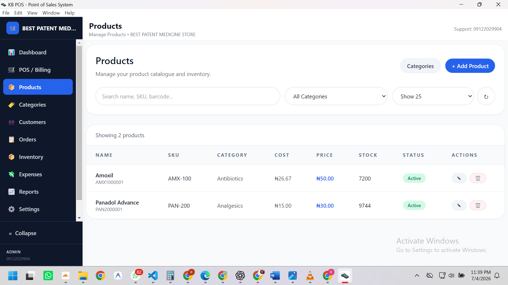
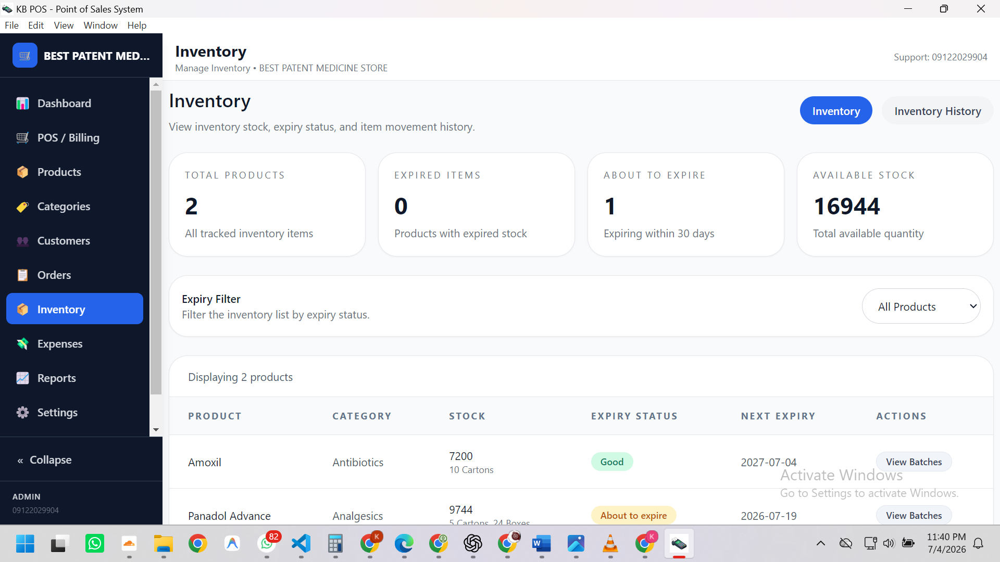
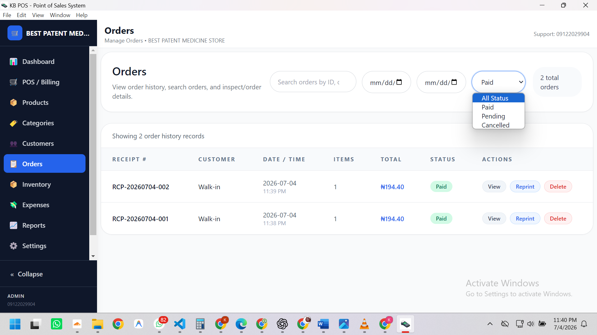
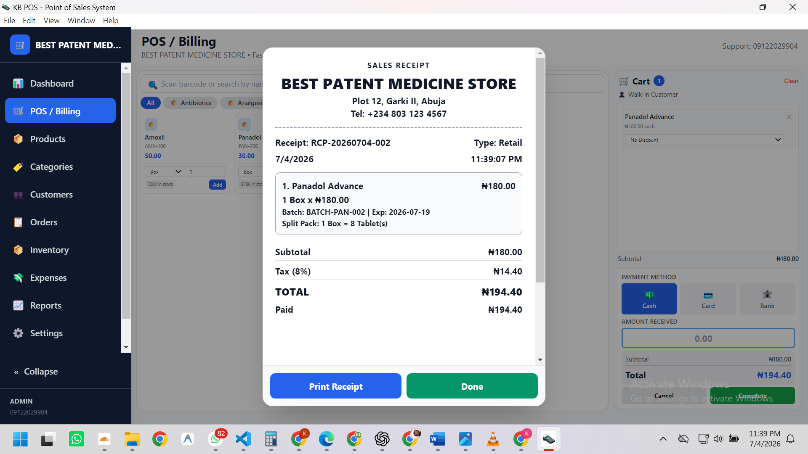
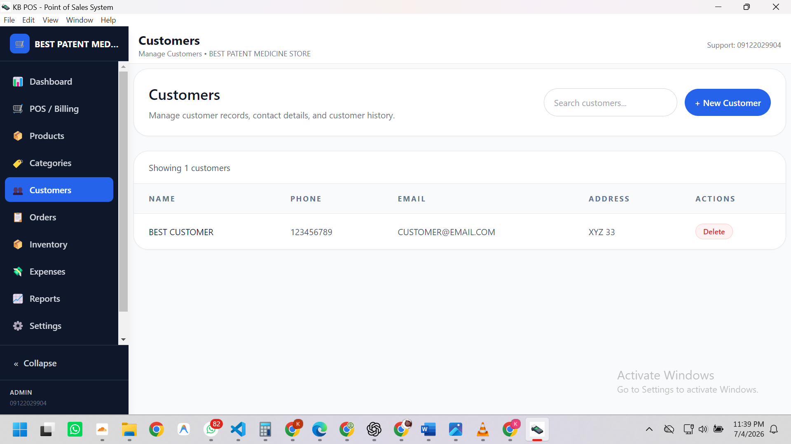
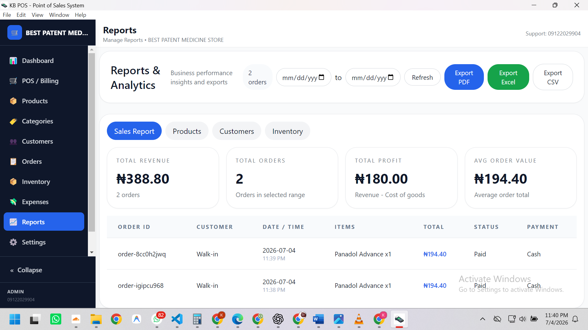
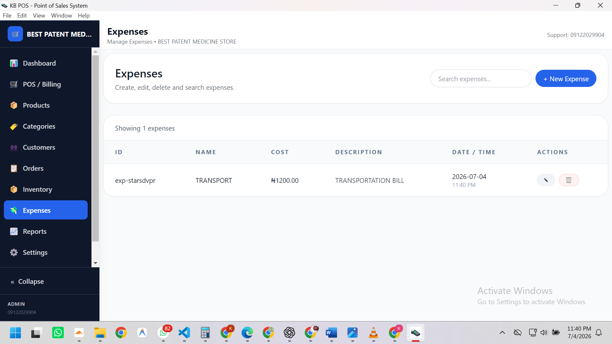
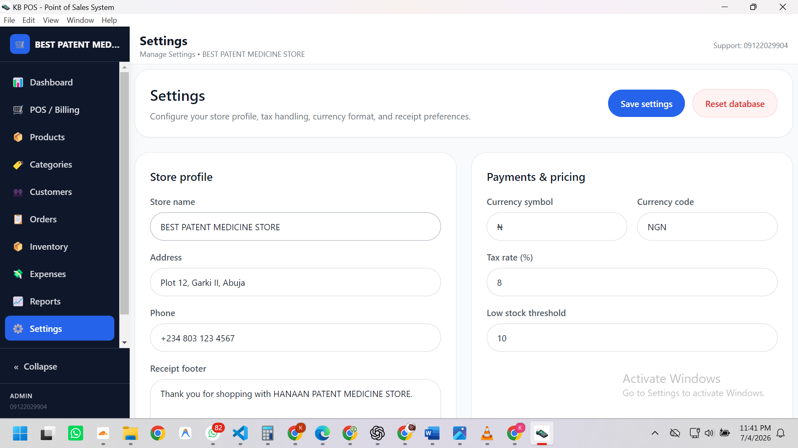

# Solvix POS

> **A modern, offline-first Point of Sale system for businesses of every size.**

Solvix POS is a powerful desktop Point of Sale (POS) application built with **Next.js**, **React**, **TypeScript**, and **Electron**. It combines the reliability of native desktop software with a modern interface, enabling businesses to manage sales, inventory, finances, and reporting from a single application.

Designed for speed, simplicity, and flexibility, Solvix POS works **completely offline** while automatically synchronizing data whenever an internet connection becomes available.

---

# 🎉 Stable Release

We are excited to announce the **first stable release** of **Solvix POS Community Edition**.

**Release Date:** **9 July 2026**

This marks the beginning of our mission to provide modern, enterprise-quality business software that is accessible to everyone.

The Community Edition is **completely free**, and the source code will be published shortly after this release to encourage community contributions and transparency.

---

# Features

## Point of Sale

- Fast checkout experience
- Multiple payment methods
- Sales history
- Returns and refunds
- Receipt generation and printing

## Inventory Management

- Product management
- Categories
- Stock tracking
- Low stock monitoring
- Barcode support
- QR Code support

## Business Analytics

- Sales reports
- Inventory reports
- Financial summaries
- Revenue analytics
- Dynamic dashboards

## Business Management

- Multi-business support
- Tax configuration
- Customer management
- Expense management
- Order management

## Offline First

- Full offline operation
- Automatic synchronization
- Reliable local storage
- Internet optional

## Customization

- Business branding
- Configurable taxes
- Flexible settings
- Modern responsive interface

---

# Screenshots

## Dashboard



## Point of Sale



## Products



## Inventory



## Orders



## Receipt



## Customers



## Reports



## Expenses



## Settings



---

# Installation (Windows)

1. Download the latest installer from the Releases page.
2. Run:

```
Solvix POS Setup.exe
```

3. Follow the installation wizard.
4. Launch Solvix POS from the Start Menu or Desktop shortcut.

No additional configuration is required.

---

# Development Setup

## Requirements

- Node.js 18+
- npm
- Git

## Clone the repository

```bash
git clone https://github.com/your-org/solvix-pos.git

cd solvix-pos
```

## Install dependencies

```bash
npm install
```

Install Electron development helper:

```bash
npm install --save-dev electron-is-dev
```

## Run the application

Start Next.js:

```bash
npm run dev
```

Open another terminal:

```bash
npm start
```

---

# Building

Create a production Windows installer:

```bash
npm run pack
```

The generated installer will be available inside:

```
dist/
```

---

# Project Structure

```
solvix-pos/

├── app/
├── assets/
├── components/
├── main.js
├── preload.js
├── package.json
└── tailwind.config.ts
```

---

# Technology Stack

- Next.js
- React
- TypeScript
- Electron
- Tailwind CSS

---

# Contributing

Community contributions are welcome.

Once the source code is published, you can:

- Fork the repository
- Create a feature branch
- Commit your changes
- Open a Pull Request

Please follow the existing coding standards and include documentation where appropriate.

---

# Support

For bug reports, feature requests, or questions, please open an Issue in the GitHub repository after the source code is published.

---

# License

MIT License

---

# About Solvix

Solvix POS is developed by **Solvix Innovations**, with a vision of building practical, reliable, and modern business software for organizations of every size.

**Built for Business. Designed for Everyone.**
